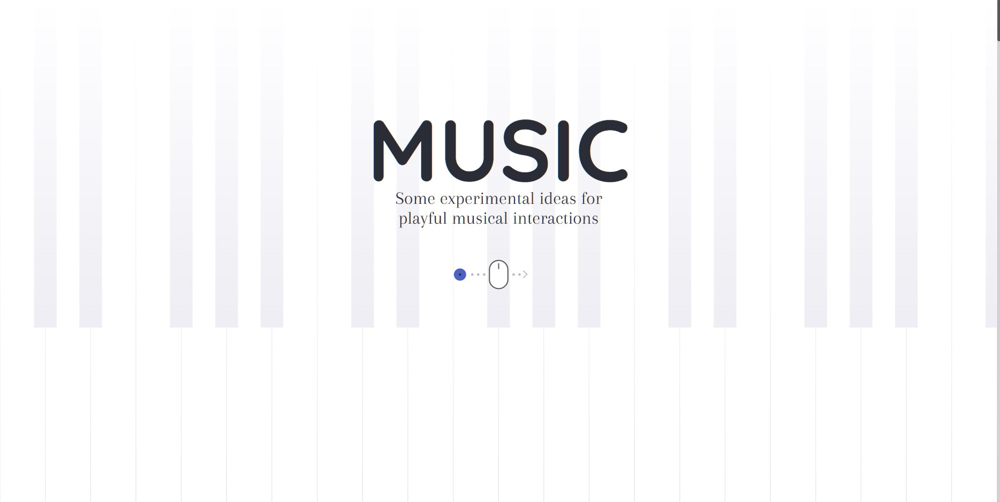

# Music-Experiments

Interactive Music Instruments
 
         

 
<a href="https://houssemlachtar.github.io/Music-Experiments/">
        Demo
    </a>

## Used Tools

  
Used Libraries

  

1. [enquire.js](https://wicky.nillia.ms/enquire.js/).
2. [anime.js](https://animejs.com).
3. [mousetrap.js](https://craig.is/killing/mice).  
        

  
Used API

  

1. Web MIDI
2 .Web AUDIO
        

## Responsive ✔️

## Follow me on

[Instagram](https://www.instagram.com/houssem_lachtar/), [Linkedin ](https://www.linkedin.com/in/houssem-lachtar/), [Codepen](https://codepen.io/houssem-lachtar), [GitHub](https://github.com/houssemlachtar)
